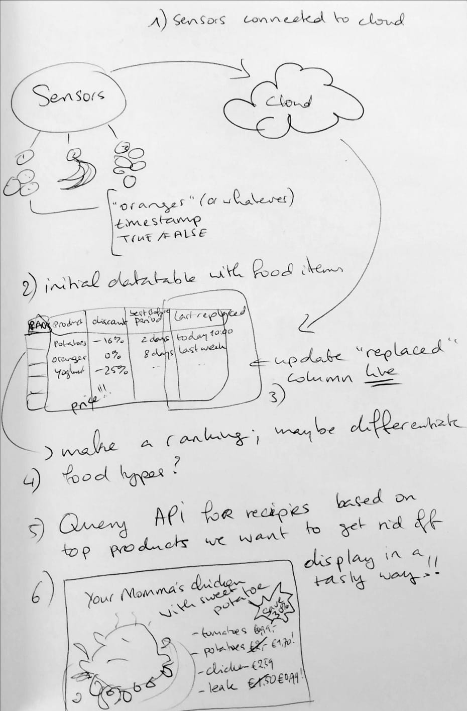
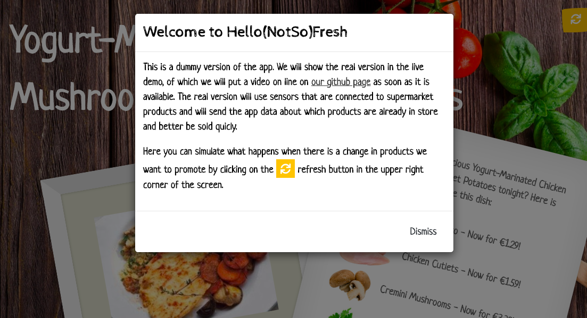

# Hello(NotSo)Fresh

### By Team _"to be revealed soon"_

_A project by Emelie Hofland and Jaime González-Arintero for the [EarthxHack](https://earthxhack.weareasterisk.com) online event, on April 24-26, 2020._

## Introduction

According to [recent studies](https://www.nrdc.org/sites/default/files/wasted-food-IP.pdf), supermarkets throw away 43 billion pounds of food every year and this is considering the U.S. alone. Grocery stores cause [10% of the U.S. foodwaste](https://www.dumpsters.com/blog/grocery-store-food-waste-statistics), making grocery store food waste into a massive problem. 

Hello(NotSo)Fresh is an initiative to avoid excessive grocery store food waste by promoting products that are still good but need to be sold rather sooner than later. To do this, it uses **sensor data** to keep track of how long food products have been in store. This way, we can make a **ranking of products that need to sell** and products that are in deal and automatically **generate delicious recipes** with those product to show to the customers.

Another advantage is that people will get inspired to try out new dishes and ingredients, therefore also contributing to a more varied diet. 

Here is a mock up of the Hello(NotSo)Fresh application:


## Live demo

[PLACEHOLDER]

## Solution architecture

[PLACEHOLDER]

Initial idea:



## Technical setup

### Supermarket sensors

A set of sensors have been installed in order to track the stock, and to detect when the products remain too long on the shelf. The measurements are sent to the Adafruit IO platform using a ESP32 development board, shown below.

<!---->

#### Requirements

* ESP-32 development kit (or similar)
* Sensorzzzz
* [Arduino IDE](https://www.arduino.cc/en/main/software)
* [Adafruit IO Arduino library](https://learn.adafruit.com/welcome-to-adafruit-io/libraries)
* [ESP32 board support for Arduino] (https://randomnerdtutorials.com/installing-the-esp32-board-in-arduino-ide-windows-instructions/)

#### Setup

First of all, create a free account in [Adafruit IO](https://io.adafruit.com).

### Shiny application

The web application is build with R shiny. To showcase the app, we have uploaded a dummy version to shinyapps.io, with which the function of the app can be simulated.

The dummy app can be visited via [think link](https://emelieh21.shinyapps.io/dummy-app/) and the source code can be found in the [dummy-app](dummy-app).



The app is hosted on [shinyapps.io](shinyapps.io). To deploy the app, all that was needed was an account on shinyapps.io and running the following code:

*deploy_app.R*

```R
# deploy app
library(rsconnect)

# https://shiny.rstudio.com/articles/shinyapps.html
# You can get the needed info from https://www.shinyapps.io/admin/#/tokens
rsconnect::setAccountInfo(name='<USER_NAME>',
                          token='<TOKEN>',
                          secret='<SECRET>')

setwd('/path/to/dummy-app/')
deployApp()
```

## To do

* Everything else

## License

Copyright (C) 2020 Emelie Hofland <emelie_hofland@hotmail.com>, Jaime González-Arintero <a.lie.called.life@gmail.com>

Permission is hereby granted, free of charge, to any person obtaining a copy of this software and associated documentation files (the "Software"), to deal in the Software without restriction, including without limitation the rights to use, copy, modify, merge, publish, distribute, sublicense, and/or sell
copies of the Software, and to permit persons to whom the Software is furnished to do so, subject to the following conditions:

The above copyright notice and this permission notice shall be included in all copies or substantial portions of the Software.

Except as contained in this notice, the name(s) of the above copyright holders shall not be used in advertising or otherwise to promote the sale, use or
other dealings in this Software without prior written authorization.

THE SOFTWARE IS PROVIDED "AS IS," WITHOUT WARRANTY OF ANY KIND, EXPRESS OR IMPLIED, INCLUDING BUT NOT LIMITED TO THE WARRANTIES OF MERCHANTABILITY,
FITNESS FOR A PARTICULAR PURPOSE AND NONINFRINGEMENT.  IN NO EVENT SHALL THE AUTHORS OR COPYRIGHT HOLDERS BE LIABLE FOR ANY CLAIM, DAMAGES OR OTHER
LIABILITY, WHETHER IN AN ACTION OF CONTRACT, TORT OR OTHERWISE, ARISING FROM, OUT OF OR IN CONNECTION WITH THE SOFTWARE OR THE USE OR OTHER DEALINGS IN THE
SOFTWARE.