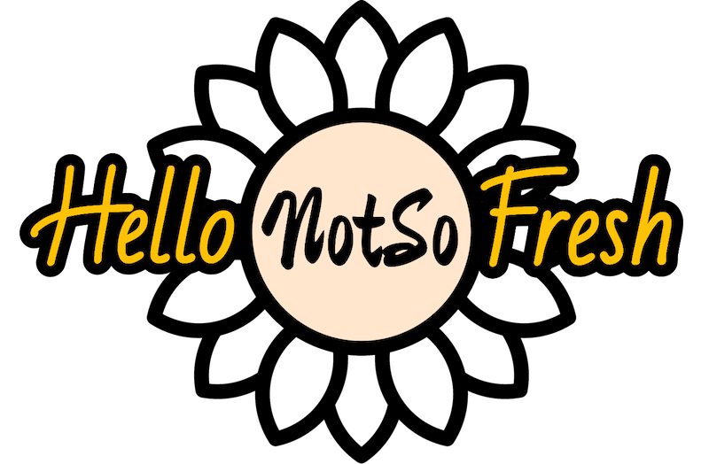
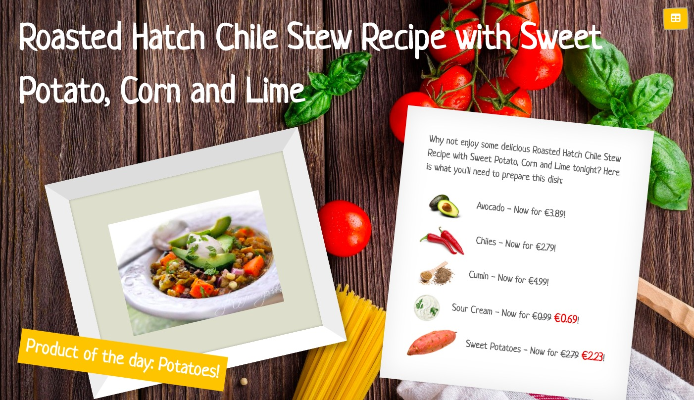
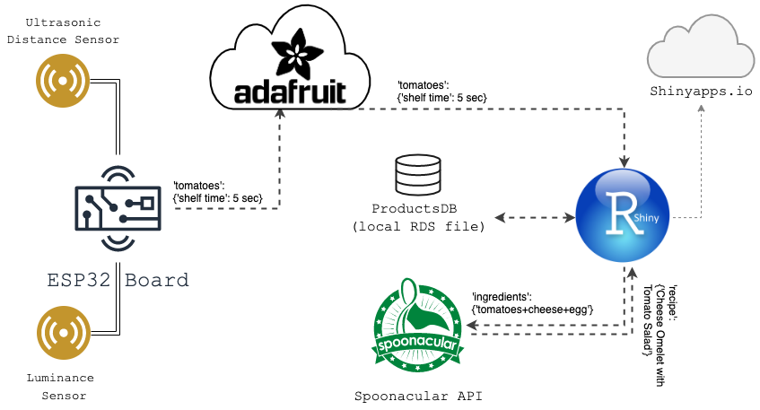
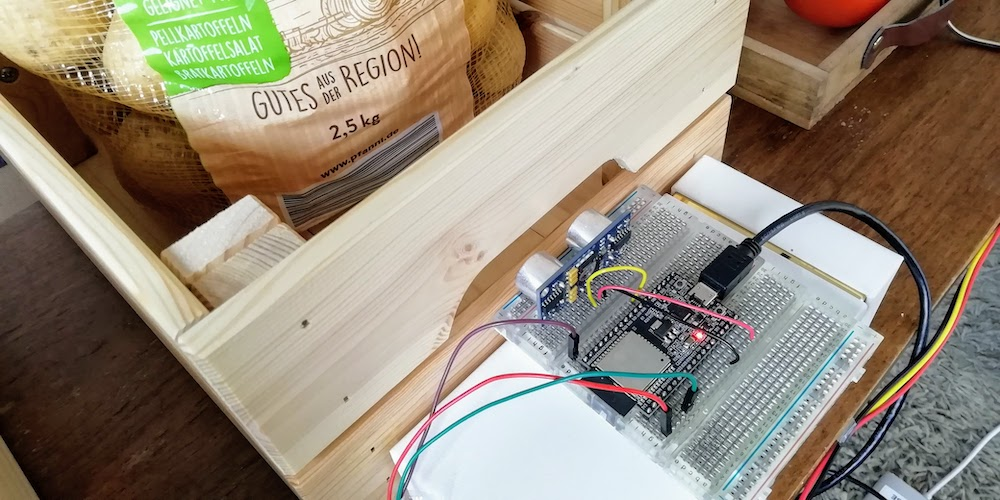
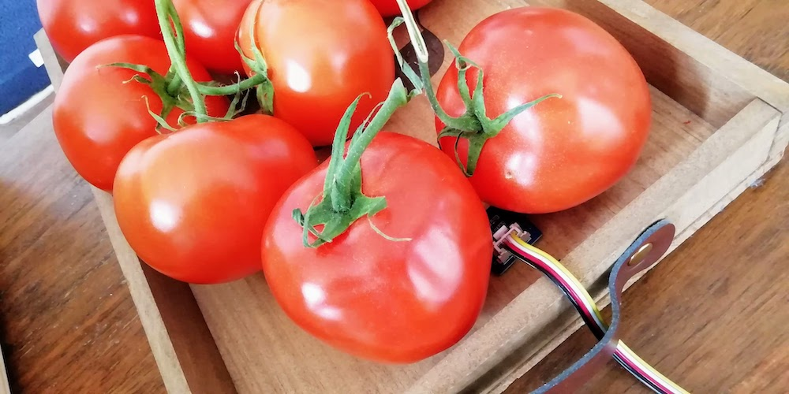
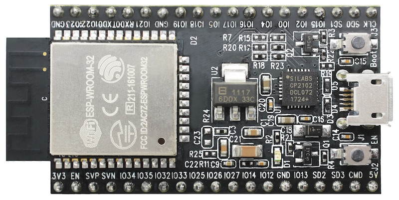
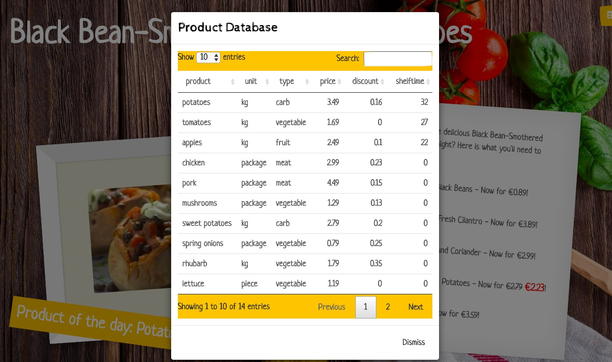

<p align="center">
	
</p>
<h1 align="center">
  Hello(NotSo)Fresh
</h1>

### By Team _"TexasTopf"_
 
_Food waste? Nein danke! A project by Emelie Hofland and Jaime González-Arintero for the [EarthxHack](https://earthxhack.weareasterisk.com) online event, on April 24-26, 2020._

## Introduction

According to [recent studies](https://www.nrdc.org/sites/default/files/wasted-food-IP.pdf), supermarkets throw away 43 billion pounds of food every year and this is considering the U.S. alone. Grocery stores cause [10% of the U.S. foodwaste](https://www.dumpsters.com/blog/grocery-store-food-waste-statistics), making grocery store food waste into a massive problem. 

_Hello(NotSo)Fresh_ is an initiative to avoid excessive grocery store food waste by promoting products that are still good but need to be sold rather sooner than later. To do this, it uses **sensor data** to keep track of how long food products have been in store. This way, we can make a **ranking of products that need to sell** and products that are in deal and automatically **generate delicious recipes** with those product to show to the customers.

Another advantage is that people will get inspired to try out new dishes and ingredients, therefore also contributing to a more varied diet. 

Here is a mock up of the Hello(NotSo)Fresh application:



## Live demo

[PLACEHOLDER]

## Solution architecture

This chart shows the technical setup of our project.



## Technical setup

### Supermarket sensors

A set of sensors have been installed in order to track the stock, and to detect when the products remain too long on the shelf. As a proof of concept, to simulate a shelf in a grocery store, a few products have been placed in wooden boxes.

In the absence of reliable weight sensors, and since this project has been fully implemented at home, **two alternative sensors have been used to detect if the products remain in the shelves**. 

The stock of one of the wooden boxes is tracked by means of an **ultrasonic distance sensor**, as shown below. When the box is full, the sensor will detect the objects in front of it, in this case the potatoes:



The stock of the wooden tray is tracked using a **luminance sensor**. When the tray is full, the luminosity measured by the sensor changes:



Mainly, two variables are being tracked for each product:

* The **"stock"** of the products: i.e. if the products in particular are still on stock
* The **"shelf time"**: this is, the time that the products have been on the shelves; the longer they remain unpurchased, the closer they will get to their _best before_ date; for the demo, the "shelf time" has been tracked in seconds, as a quick proof of concept.

This measurements are sent to the [Adafruit IO](https://io.adafruit.com) platform (free of charge) using a ESP32 development board, shown below.



#### Requirements

* [ESP-32](https://en.wikipedia.org/wiki/ESP32) development kit (or similar)
* [Ultrasonic distance sensor](https://www.parallax.com/product/28015)
* [Luminance sensor](https://www.seeedstudio.com/Grove-Luminance-Sensor.html)
* Prototyping breadboard
* Connecting wires and USB cable
* [Arduino IDE](https://www.arduino.cc/en/main/software)
* [Adafruit IO Arduino library](https://learn.adafruit.com/welcome-to-adafruit-io/libraries)
* [ESP32 board support for Arduino] (https://randomnerdtutorials.com/installing-the-esp32-board-in-arduino-ide-windows-instructions/)

#### Setup

First of all, create a free account in [Adafruit IO](https://io.adafruit.com).

Then, install and configure the [Arduino IDE](https://www.arduino.cc/en/main/software), and add the [support for ESP-32 boards](https://randomnerdtutorials.com/installing-the-esp32-board-in-arduino-ide-windows-instructions/).

Proceed to open the `supermarket-sensors` Arduino project that can be found in the [`hardware`](/hardware) folder of this repository. Before flashing the program on the ESP-32 development kit, remember to configure it with the Adafruit IO credentials, as well as with the desired SSID and password for the WiFi connectivity.

**-- WORK IN PROGRESS --**

## Shiny application

The web application is build with R shiny. We have used the following resources inside the app:

* 'Sketchy' bootstrap.css from [bootswatch](https://bootswatch.com/sketchy/)
* Background picture by [Daria Yakovleva](https://pixabay.com/users/Daria-Yakovleva-3938704/?utm_source=link-attribution&amp;utm_medium=referral&amp;utm_campaign=image&amp;utm_content=1932466) from [Pixabay](https://pixabay.com/photos/food-kitchen-cook-tomatoes-dish-1932466/) (free for commercial use)
* [Spoonacular API](https://spoonacular.com/food-api) for recipes, more specifically, we used the [Search-Recipes-By-Ingredients](https://spoonacular.com/food-api/docs#Search-Recipes-by-Ingredients) endpoints
* The [Adafruit IO](https://io.adafruit.com) API to query the sensor data (see technical setup for supermarkets sensor above)

### Links to the app

#### Dummy version

To showcase the app, we have uploaded a dummy version to shinyapps.io, with which the function of the app can be simulated.

The dummy app can be visited **[here](https://emelieh21.shinyapps.io/dummy-app/)** and the source code can be found in the [dummy-app](dummy-app) folder.


The app is hosted on [shinyapps.io](shinyapps.io). To deploy the app, all that was needed was an account on shinyapps.io and running the following code:

*deploy_app.R*

```R
# deploy app
library(rsconnect)

# https://shiny.rstudio.com/articles/shinyapps.html
# You can get the needed info from https://www.shinyapps.io/admin/#/tokens
rsconnect::setAccountInfo(name='<USER_NAME>',
                          token='<TOKEN>',
                          secret='<SECRET>')

setwd('/path/to/dummy-app/')
deployApp()
```

#### Live version

For the live demo we will run the app **locally** in our flat, since it only makes sense to run the 'real-live' version when we are actually moving groceries around and have the sensors connected.

However, to showcase the full functionality of the actual application, we deployed it to shinyapps.io as well (see the [app](app) folder for source code), in **'demo' mode**. This means the sensor inputs are **simulated** and the recipe API is not called, instead a **recipe is randomly chosen** from a small selection.

This version of the app can be visited **[here](https://emelieh21.shinyapps.io/hello-not-so-fresh-demo-mode/)**. This link allows to see how the app functions with the **product table** that updates according to how long products are in store (products being removed or replaced is being simulated in the background) and the change it triggers in the displayed recipe.




## License

Copyright (C) 2020 Emelie Hofland, Jaime González-Arintero <a.lie.called.life@gmail.com>

Permission is hereby granted, free of charge, to any person obtaining a copy of this software and associated documentation files (the "Software"), to deal in the Software without restriction, including without limitation the rights to use, copy, modify, merge, publish, distribute, sublicense, and/or sell
copies of the Software, and to permit persons to whom the Software is furnished to do so, subject to the following conditions:

The above copyright notice and this permission notice shall be included in all copies or substantial portions of the Software.

Except as contained in this notice, the name(s) of the above copyright holders shall not be used in advertising or otherwise to promote the sale, use or
other dealings in this Software without prior written authorization.

THE SOFTWARE IS PROVIDED "AS IS," WITHOUT WARRANTY OF ANY KIND, EXPRESS OR IMPLIED, INCLUDING BUT NOT LIMITED TO THE WARRANTIES OF MERCHANTABILITY,
FITNESS FOR A PARTICULAR PURPOSE AND NONINFRINGEMENT.  IN NO EVENT SHALL THE AUTHORS OR COPYRIGHT HOLDERS BE LIABLE FOR ANY CLAIM, DAMAGES OR OTHER
LIABILITY, WHETHER IN AN ACTION OF CONTRACT, TORT OR OTHERWISE, ARISING FROM, OUT OF OR IN CONNECTION WITH THE SOFTWARE OR THE USE OR OTHER DEALINGS IN THE
SOFTWARE.